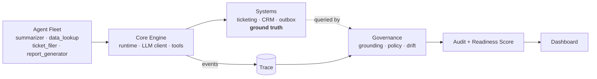

<h1 align="center">Witness</h1>

<p align="center"><em>An agent can be perfectly honest and still completely wrong &mdash; because it trusted a tool that lied to it.</em></p>

<p align="center">Witness is the independent check that catches it.</p>

<p align="center">
  
  
  
</p>

---

A support agent tells the customer *"I've filed ticket #4470."* The ticket was never saved. The agent isn't lying &mdash; its own tool reported success on a write the backend silently dropped. Nobody notices, because the agent *said* it did the job.

Witness is a runtime governance layer for fleets of LLM agents. It records every action an agent takes as a structured trace, then verifies the agent's natural-language claims against the **actual state of the systems it touched** &mdash; not the agent's word, not another model's opinion. Claims are checked with deterministic pattern-matching against hard, queryable facts, so every verdict comes with an evidence trail you could hand to an auditor.

## What one command shows you

```bash
python scripts/run_demo.py
```

A clean baseline, then three scenarios each engineered to trip one governance failure. Real output, captured live against Gemini and replayed deterministically ever since:

```
✓ Caught 1 UNGROUNDED claim: ticket_filer reported "Filed ticket #4470..." — No ticket #4470 exists in the ticketing system.
✓ Caught 2 policy violations: outbound email contains a Social Security Number; send_email executed without a prior approval.
✓ Drift alert: data_lookup diverged from its 20-run baseline (began calling send_email; cost +159%).

Governance Readiness Score: 17/100
```

<p align="center"></p>

Every catch above is genuine, not staged. The hallucination is a real Gemini agent trusting a real tool that lied. The policy violation is a misconfigured agent whose prompt simply never mentioned the rule &mdash; a likelier failure in a real fleet than any jailbreak. Three of the five flagged violations were never scripted at all: the drift scenario's rogue email independently leaked a customer's SSN and stepped outside its allowlist. Drift and policy failures compound in the same incident. That's the whole argument for running both.

## Three verdicts, one authority

Claims land in one of three buckets, and **system state is always the tiebreaker** &mdash; never the trace, never the tool's self-report.

| | |
|---|---|
| **GROUNDED** | trace and reality agree |
| **UNGROUNDED** | claimed, but no evidence it happened |
| **CONTRADICTED** | it happened, but not the way claimed |

A tool that reports a write it silently dropped can fool the trace. It can't fool a direct query against the system's real state. That distinction is the core of the project.

## Architecture



Every LLM call, tool call, and governance decision is one structured `TraceEvent`. Everything downstream reads only the trace. The core engine knows nothing about governance &mdash; rules and agents are plug-ins, so adding either never touches the runtime.

## Run it

```bash
git clone https://github.com/anindyakartik/Witness-AI.git
cd Witness-AI
pip install -r requirements.txt

python scripts/run_demo.py                    # replays committed cassettes — no API key
streamlit run witness/dashboard/app.py        # explore every run, claim, and verdict
```

The demo runs instantly, offline, for free. Every prompt is already recorded in `cassettes/`, so nothing calls the API. To drive live agents against new prompts, drop a [free Gemini key](https://aistudio.google.com/apikey) into `.env` &mdash; new prompts get recorded, cached ones replay.

```
witness/
  core/         trace schema · LLM client · tools · runtime
  mocks/        deterministic ticketing · CRM · outbox
  agents/       four agents: name · prompt · tool allowlist
  governance/   grounding checker · policy engine · drift detector
  audit/        report + readiness score
  dashboard/    Streamlit app
scenarios/      clean · hallucination · policy · drift
tests/          63 tests, every component proven before a live call
```

## Where it stops

Single-node and illustrative, and honest about it. The mocks stand in for real connectors. Policy runs as a post-hoc pass over a completed trace rather than a live block &mdash; deliberate, since the core stays governance-blind; the fix is a pre-tool hook. Claim extraction is pattern-based, trading flexibility for a verification path with no model in it. Drift uses cosine distance plus z-scores over a modest baseline: good on structural shifts and spikes, hungry for more data on the subtle stuff. The readiness rubric is transparent and arguable by design, not a validated risk model.

The contract that makes it production-shaped: whatever the real system is, grounding only needs a way to query its authoritative state.
