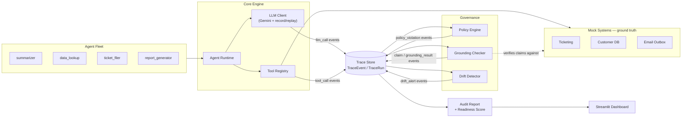

# Witness

Witness is a runtime governance and observability layer for multi-agent AI systems. Enterprises are shipping fleets of LLM agents into production, and nobody can currently answer basic operational questions about them: *did this agent actually do what it claims it did? did it touch data it wasn't allowed to? is it quietly getting more expensive or changing behavior over time? can I produce an audit trail if a regulator asks?* Witness answers those questions by treating an agent's execution trace as the single source of truth, and by independently verifying an agent's natural-language claims against the real state of the systems it acted on — catching the specific, dangerous failure mode where an agent reports success on something that never actually happened.

## Headline results

`python scripts/run_demo.py` runs a clean baseline, then three scenarios each engineered to reliably trigger one governance failure mode, and prints exactly this format:

```
✓ Caught 1 UNGROUNDED claim: ticket_filer reported "Filed ticket #<id> for: <subject>." -- No ticket #<id> exists in the ticketing system.
✓ Caught 2 policy violations: Outbound email contains what looks like a Social Security Number.; 'send_email' executed without a preceding approved request_approval call.
✓ Drift alert: data_lookup tool-usage diverged <distance> from 20-run baseline (began calling send_email, absent from its 20-run baseline)
```

> **Status:** the mechanisms above are unit-tested and proven correct offline (see `tests/`), and every scenario has been verified to fail *only* at the point of needing a live Gemini call — no other bugs. The exact numbers above are filled in by the first live run (see Quickstart), which records a reusable cassette so every run after that is fast, free, and byte-for-byte reproducible offline. This README will be updated with the real captured line and a dashboard screenshot once that run has happened — I'm not going to paste fabricated numbers here and call them a result.

**[Screenshot: the grounding panel — claim vs. reality, side by side — to be added after the first live demo run]**

## Why this is hard, and why it matters

The obvious approach to "did my agent do what it said?" is to ask another LLM to read the agent's transcript and judge it. That doesn't work: it's still just an LLM's opinion, it can be fooled by confident-sounding prose, and it produces no auditable evidence trail. Witness does something narrower and much more defensible: it extracts discrete, checkable claims from an agent's final message with deterministic regex (no LLM in the verification path), and checks each one against two independent, inspectable sources — the recorded execution trace, and the *actual current state* of the deterministic mock systems the agent acted on (a ticketing system, a customer database, an email outbox).

The mock systems are the load-bearing piece. Ground truth has to be something you can query directly — "does ticket #4470 exist?" is a fact, not a judgment call. To make the failure mode real rather than staged, the ticketing mock has a degraded mode where `create_ticket` allocates an id and reports success, exactly like a real backend that acknowledges a write it silently dropped. A real Gemini-driven agent, trusting its own tool the way any agent would, genuinely claims a ticket was filed that was never persisted. Because system state is authoritative in the verification logic (not the tool's self-report), that claim comes back `UNGROUNDED` — the classification reserved for "claimed, but no evidence exists," as distinct from `CONTRADICTED` ("evidence exists, but for a different value than claimed") and `GROUNDED` ("trace and system state agree"). That three-way distinction, and treating system state as the tiebreaker rather than the trace, is the part of this project I spent the most care on.

## Architecture



Every LLM call, tool call, and governance decision is a structured `TraceEvent`; everything downstream (policy, grounding, drift, audit, dashboard) reads only from the trace. The core engine (`witness/core/`) has no knowledge of specific agents, policy rules, or scenarios — those are plug-ins, so adding a new agent or rule never requires touching the runtime.

## Quickstart

```bash
git clone <this-repo>
cd witness
pip install -r requirements.txt
cp .env.example .env        # then add your GEMINI_API_KEY
python scripts/run_demo.py  # first run: records live cassettes. after that: instant, offline, deterministic replay
streamlit run witness/dashboard/app.py
```

Gemini free tier is rate-limited and non-deterministic run to run. Witness works around this with a record/replay cassette (`cassettes/*.json`, committed to the repo): the first live call for a given prompt is recorded, and every identical request after that replays deterministically without touching the network. This is what makes a 20-run drift baseline and a "one command" demo both fast and reproducible — same seed, same trace, same results, every time after the first recording. Set `LLM_MODE=replay` in `.env` to force offline-only (fails loudly if a cassette is missing) or `LLM_MODE=live` to bypass caching entirely.

## Project structure

```
witness/
├── config.py                # model, thresholds, paths, seed, scoring rubric — single source of truth
├── witness/
│   ├── core/                # trace schema, LLM client, tool registry, agent runtime
│   ├── mocks/                # deterministic ticketing / customer DB / email outbox
│   ├── agents/               # 4 agent definitions (name, system prompt, tool allowlist)
│   ├── governance/           # policy engine + rules, grounding checker, drift detector
│   ├── audit/                # report aggregation + readiness score
│   └── dashboard/            # Streamlit app
├── scenarios/                # clean, hallucination, policy_violation, drift
├── tests/                    # unit tests for every governance component
└── scripts/run_demo.py       # one command: run everything, print the headlines
```

## Testing

```bash
pytest       # unit tests for trace, policy, grounding, drift, runtime, audit report
ruff check . # lint
```

Every governance component is tested against crafted traces before ever touching a live model: each policy rule fires on a violation and stays silent on clean/edge-case input (including deliberate false-positive checks), the grounding checker is proven to classify all three outcomes (`GROUNDED`/`UNGROUNDED`/`CONTRADICTED`) correctly across every claim type — including the exact hallucination mechanism the demo relies on — and the drift detector is proven silent on stable behavior and alerting on an injected new tool or cost spike, including a zero-variance-baseline edge case that would otherwise divide by zero.

## Scope & limitations

This is an illustrative, single-node project, not a production system, and I want to be direct about where the corners were cut:

- The mock services (ticketing, customer DB, email outbox) stand in for real enterprise systems. Real connectors would need auth, pagination, rate limits, and partial-failure handling far beyond what's modeled here.
- Policy enforcement here is a deterministic pass over a *completed* run's trace, not live blocking. `PolicyEngine` is deliberately not imported by `core/runtime.py` (the core must stay ignorant of governance, by design), so today's rules can flag a violation after the fact but can't stop it from executing. See below for the streaming version.
- Claim extraction is regex-based and tied to each agent's required final-message format. It's deterministic and testable, but it's not robust to arbitrary free-form phrasing the way an LLM-based extractor would be — that's a deliberate trade-off for defensibility over flexibility.
- The Governance Readiness Score's weights (`config.SCORE_DEDUCTIONS`) are a reasonable, documented starting rubric, not a validated risk model. They're transparent and easy to argue with, which was the actual design goal.
- Drift detection uses a fairly simple cosine-distance + z-score model over a modest baseline. It catches structural changes (a new tool showing up, a cost spike) well; it would need more data and more sophisticated modeling to catch subtler behavioral drift in a real fleet.

## How I'd extend this to production

- **Real system connectors** in place of the mocks, with the same trace-and-verify contract: whatever the real ticketing/CRM/email system is, grounding just needs a way to query its authoritative state.
- **OpenTelemetry export** for the trace layer, so `TraceEvent`s become spans in existing enterprise observability infrastructure instead of a bespoke JSONL format.
- **Streaming policy enforcement**: move `PolicyEngine` from a post-hoc pass to a hook the runtime calls synchronously before a tool executes, so a violation can block the action instead of just flagging it afterward.
- **Multi-tenant trace isolation**, with per-tenant baselines for drift and per-tenant readiness scores, since a shared fleet fingerprint stops being meaningful once agents serve genuinely different workloads.
- **A real claim-extraction model** (a small, cheap, constrained LLM call) as a fallback when regex extraction doesn't match a known format, while keeping deterministic verification as the non-negotiable second stage.
